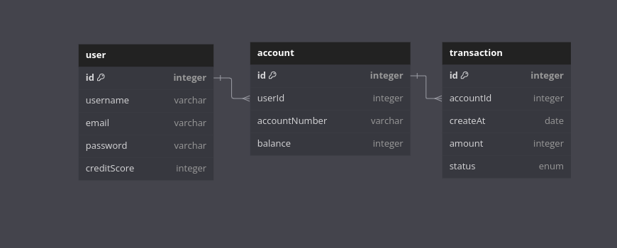

# Simple Credit REST API Application

## Overview

This application is a REST API for simple credit management, built using Java Spring Boot and PostgreSQL. It implements CRUD operations and uses JWT for authentication.

## Key Features

- User account management (registration, login, profile updates)
- Loan application and management
- Credit score system for evaluating loan eligibility
- Recording and tracking of loan transactions
- Loan restrictions based on credit score and active loans

## Technical Implementation

- Java Spring Boot framework
- PostgreSQL database with JPA native queries
- JWT for API authentication and authorization
- Spring Security for application security management
- Spring Validation for data validation

## Credit Score Feature

- Credit score calculation based on loan history and payment records
- Maximum loan limits determined by credit score
- Automatic rejection of new loan applications for users with active loans or low credit scores

# ERD Table

# API Endpoints

This README provides an overview of the available API endpoints in our application.

## Account Controller

| Endpoint | Method | Function |
|----------|--------|----------|
| `/api/account` | POST | Create a new account |
| `/api/account/{id}` | GET | Retrieve a specific account by ID |
| `/api/account` | GET | Retrieve all accounts |
| `/api/account/{id}` | PUT | Update a specific account |
| `/api/account/{id}` | DELETE | Delete a specific account |
| `/api/account/withdraw` | PUT | Withdraw money from an account |

## Auth Controller

| Endpoint | Method | Function |
|----------|--------|----------|
| `/api/auth/login` | POST | User login |
| `/api/auth/register` | POST | User registration |

## Transaction Controller

| Endpoint | Method | Function |
|----------|--------|----------|
| `/api/transaction` | POST | Create a new transaction |
| `/api/transaction/{id}` | GET | Retrieve a specific transaction by ID |
| `/api/transaction` | GET | Retrieve all transactions |
| `/api/transaction/{id}` | PUT | Update a specific transaction |
| `/api/transaction/{id}` | DELETE | Delete a specific transaction |

## User Controller

| Endpoint | Method | Function |
|----------|--------|----------|
| `/api/user/{id}` | GET | Retrieve a specific user by ID |
| `/api/user` | GET | Retrieve all users |
| `/api/user/{id}` | PUT | Update a specific user |
| `/api/user/{id}` | DELETE | Delete a specific user |

Note: All endpoints require authentication except for the login and register endpoints in the Auth Controller. The specific authentication mechanism and required permissions.

Link postman: https://www.postman.com/cryosat-engineer-6624182/workspace/credits-app/collection/36650247-3b24eaf9-cd0d-4c23-aead-cbea982a671f?action=share&creator=36650247